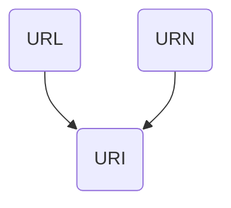

___
### 1. Различия между URL, URN и URI

Существуют три похожих аббревиатуры:

abbr | full
-|-
URN | Uniform Resource Name
URL | Uniform Resource Locator
URI | Uniform Resource Identificator

Рассмотрим подробно, что они означают:
- URL - определяет местонахождение ресурса в сети и способ его извлечения.

- URN - неизменяемая последовательно символов, определяющая только имя некоторого ресурса. URN должен быть уникален во времени и пространстве (имен). Однако для того, чтобы определить местанахождение ресурса по URN, нужно обращаться к системе разрешения имен URN, где он зарегистрирован.

- URI - это обобщенное понятие, идентификатор ресурса. Причем ресурс может быть идентифицирован любыми способами, например с помощью URL или URN, или каким-нибудь новым способом.

URI generic syntax

### 2. URL

Для описания URL используется только [ограниченный набор символов](https://www.rfc-editor.org/rfc/rfc3986#section-2.3).
В ограниченный набор символов входят следующие символы:
- зарезервированные (reserved)
- незарезервированные (unreserved)
- символ `%`, для экранирования

##### 2.1. Reserved
Зарезервированные символы это разного рода разделители, которые делят URL на компоненты и субкомпоненты.
`gen-delims  = ":" / "/" / "?" / "#" / "[" / "]" / "@"`
`sub-delims  = "!" / "$" / "&" / "'" / "(" / ")" / "*" / "+" / "," / ";" / "="`
Если все же в URL нужно применить зарезервированные символы, то они должны быть экранированы с помощью знака `%`.

##### 2.2. Unreserved

Незарезервированные символы, это все остальные разрешенные символы:
`unreserved  = ALPHA / DIGIT / "-" / "." / "_" / "~"`

>[!warning]
>Пробел НЕ является разрешенным символом для URL.

##### 2.3. Структура URL

Структуру URL можно описать следующим образом:
`URL=схема:[//[логин[:пароль]@]хост[:порт]][/urlпуть][?параметры][#якорь]`

`схема` - схема обращения к ресурсу, обычно сетевой протокол
`логин`, `пароль` - сразу идентификация и возможно аутентификация
`хост`, `порт` - обозначение сокета
`urlпуть` - дополнительная информация о нахождении ресурса
`параметры` - строка с передаваемыми на сервер (методом GET) параметрами. Параметры это список пар ключ-значение, разделенный делиметером. Пример: `key1=value1&key2=value2
`якорь` - документ, который мы запрашиваем может состоять из множества элементов. С помощью якоря мы указываем на то, какой элемент нас на самом деле интересует. Это используется, например, для ссылок на статьи.

### 3. PURL

URL - может указывать на уже удаленный или перемещенный ресурс. Для того, чтобы решить эту проблему был придуман PURL (persistent URL).

PURL записывается таким же образом как и URL, но он указывает на запись в базе данных, которая хранит настоящий URL. Таким образом, при обращении через PURL пользователь автоматически перенаправляется по нужному адресу, где на самом деле хранится ресурс.

Пример PURL: `http://purl.oclc.org/OCLC/PURL/FAQ`, где:
`purl.oclc.org` - сервер с БД PURL
`OCLC/PURL/FAQ` - имя PURL

>[!tip]
>OCLС - некомерческая организация, которая предоставляет этот сервис бесплатно всем желающим. Поэтому нет смысла делать свой собственный PURL-сервер. Нужно пользоваться `oclc.org`.

Однако данная система все же не лишена недостатков:
- получается два запроса вместо одного
- приходится использовать серверы сторонней компании
В итоге общим решением должен стать URN.

### 3. URN

##### 3.1. Структура URN

`<URN> ::= "urn:" <NID> ":" <NSS>`
`NID` -> namespace identifier
`NSS` -> namespace specific string
Начальная последовательность `urn:` нечувствительна к регистру.

Пример: `urn:ietf:rfc:3406`, причем здесь `ietf` -> NID, а `rfc:3406` -> NSS

##### 3.2. Самоидентифицирующийся URN

В качестве NSS удобно использовать хэш-файла. Не нужно придумывать название, а хэш отлично идентифицирует ресурс.

### 3. URI

URI это обобщенное понятие, но не абстрактное. URI имеет собственную структуру, которой должны соответствовать URI, URL и все другие типы URI, которые будут придуманы в дальнейшем.

Структура URI:
`URI=scheme:[//authority]path[?query][#fragment]`
или если разложить `authority` на субкомпоненты:
`URI=scheme:[//[userinfo@]host[:port]]path[?query][#fragment]`

>[!note]
>Минимальный URI такой: `URI=scheme:path` 
>URN соответствует такой структуре.

Элементы структуры URI:
- `scheme` -> http, https, ftp и т. д.
- `userinfo` -> `<username>` или `<username>:<password>`
- `host` -> IP-адрес или имя хоста
- `port` -> номер порта в десятичном виде
- `query`, `fragment` -> то же что в URL
- `path` -> путь к ресурсу; состоит из сегментов, разделенных слэшами. Например в URI `http://www.example.com/questions/3456/my-document`, path будет следующим: `/questions/3456/my-document`.

>[!warning]
>URI предполагает, что IP-адрес записан в десятичной форме. IPv6 кроме того, должен быть заключен в квадратные скобки.
>Примеры:  `192.168.212.39`, `[fe80::9c36:973d:dc5a:af70]`
