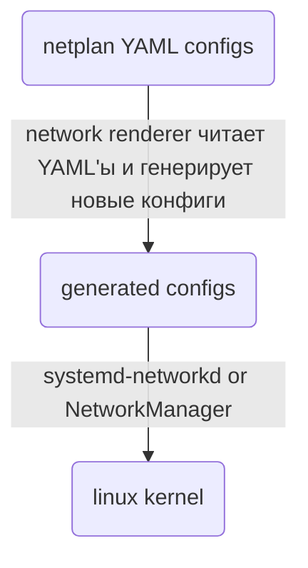

Netplan - это утилита для конфигурирования сетей в Linux. В настоящее время используется в Ubuntu по умолчанию.

https://netplan.readthedocs.io

### 1. Принципы работы netplan

1. Пользователь заполняет netplan-конфиги - конфигурационные файлы в `/{lib,etc,run}/netplan/` в формате YAML. 
2. При загрузке операционной системы network renderer на основе netplan-конфига сгенерирует новые конфиги и положит в `/run`.  network renderer - это утилита netplan.
3. Эти сгенерированные конфиги может использовать такие службы как systemd-networkd или NetworkManager.


network renderer - утилита netplan, которая на основе netplan-конфига генерирует конфиг для определенной службы.

### 2. Структура netlan-конфигов
Netplan-конфиги (далее просто конфиги) находятся в директориях `/{lib,etc,run}/netplan/` и в каждой из этих директорий может находится несколько YAML-файлов. В каждом файле могут быть указаны различные настройки, в том числе - противоречащие другу другу. Как понять, какие именно настройки будут применены?

Существуют следующие правила:

1. Директории имеют приоритет: `1.run -> 2.etc -> 3.lib`. Это значит, что файл в `/run/netplan/` полностью скрывает файл с таким же именем в папке `/etc/netplan/` и так далее.
2. Если в друх файлах есть пары ключ-значение с разными ключами - то обе пары будут действительны.
3. Если в двух файлах есть пары ключ-значение с разными ключами, то действительно будет только значение из файла, который имеет большее имя (в лексикографическом смысле).

### 3. Начальные конфиги в ubuntu 23.04
Изначально YAML-файлы содержаться только в директории /etc/netplan:
- /etc/netplan/00-installer-config.yaml:
```
# This is the network config written by 'subiquity'
network:
  ethernets: {}
  version: 2
```
- /etc/netplan/00-installer-config-wifi.yaml:
```
# This is the network config written by 'subiquity'
network:
  version: 2
  wifis: {}
```
- /etc/netplan/01-network-manager-all.yaml:
```
# Let NetworkManager manage all devices on this system
network:
  version: 2
  renderer: NetworkManager
```
Команда `sudo netplan get` возвращает следующие настройки:
```
network:
  version: 2
  renderer: NetworkManager
```

>[!note] 
>В итоге самый простой путь - добавлять все свои настройки в файл
>`/etc/netplan/01-network-manager-all.yaml`. И не забыть изменить права доступа к этому файлу, чтобы он был доступен только под рутом.


### 4. Примеры использования netplan-конфигов

netplan имеет множество возможностей и рассматривать их все здесь бессысленно. Приведем, только некоторые примеры.

##### 4.1. Добавление статического IP-адреса для определенного интерфейса

Изменения в файле: `/etc/netplan/01-network-manager-all.yaml`.
```
# Let NetworkManager manage all devices on this system
network:
  version: 2
  renderer: NetworkManager
  ethernets:
    enp3s0:
      addresses:
        - 192.168.213.100/24

```
