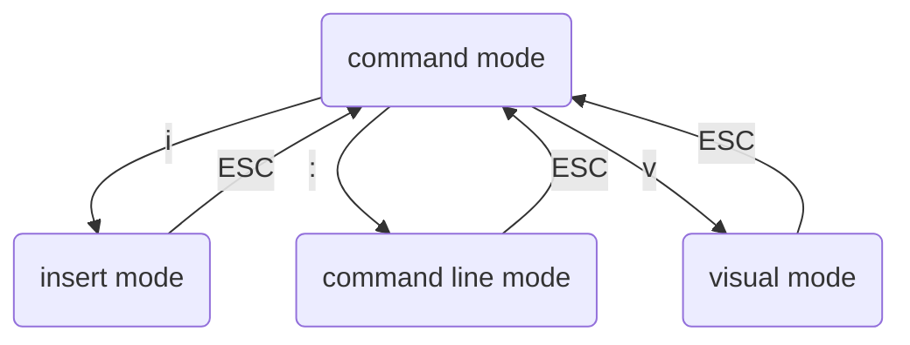

___
### Предисловие

Когда работаешь на удаленной машине по ssh зачастую нужно открыть какой-нибудь файл, а иногда и отредактировать его. Для этих целей лучше всего подходит vim, просто потому что с ним можно работать в терминале и он обычно есть на любой машине.

Но так как я не собираюсь пользоваться vim как основным редактором, то и изучать его подробно для меня нет смысла. Я хочу овладеть самым базовым функционалом, а именно:
- открыть/закрыть
- скроллинг
- базовое редактирование
- копирование и вставка

Если же vim предстоит использовать только для просмотра файлов, то сначала следует обратить внимание на следующие команды:
- `less` ([[command - less]])
- или даже иногда `cat`

___ 
### 1. Режимы

В vim есть 4 режима:
- режим команд (command mode)
- режим вставки (insert mode)
- режим командной строки (command line mode)
- визуальный режим (visual mode)
Непосредственно после запуска vim находится в режиме команд.

Переключаться между режимами можно следующим образом:

>[!tip]
>Когда мы нажимаем двоеточие и переходим в режим коммандной строки, то двоеточие выводится на экран. Поэтому если перед командой стоит двоеточие - значит команда будет исполняться в режиме командной строки, если нет - то в режиме команд.

___
### 2. Просмотр

Просмотр можно осуществлять в режиме команд. Чтобы открыть файл можно воспользоваться командами:
- `vim` -> открыть vim
- `vim <filename>` -> открыть файл в vim
- `vim -R <filename>` -> открыть файл в режиме чтения
- `view <filename>` -> то же, что и `vim -R <filename>`
В большинстве случаев следует использовать команду `view`.
- `:edit <filename>` -> открыть другой файл
- `:q` -> выйти

Во время просмотра не предполагается внесения каких-либо изменений, но если изменения были сделаны, то выйти с помощью команды `:q` уже не удастся. Нужно воспользоваться одной из следующих команд.
- `:w` -> сохранить изменения
- `:q!` -> выйти без сохранения изменений
- `:wq` -> выйти и сохранить изменения

>[!tip]
>Если файл был открыт в режиме чтения, то открыть возможность редактирования можно с помощью команды : `:set noreadonly`

___
### 3. Поиск

Настройки поиска:
- `:set ic`, `:set ignorecase`, `:set noic`, `:set noignorecase` -> no comment
- `:set hlsearch`, `:set nohlsearch` -> подсвечивать найденные слова
- `:set incsearch`, `:set noincsearch` -> инкрементальный поиск, поиск производится после введение каждой следующей буквы

Команды поиска почти такие же как для команды `less`:
- `/<expression>`, `?<expression>` -> произвести поиск в прямом/обратном направлении
- `//`, `??` -> повторить поиск в прямом/обратном направлении
- `n`, `N` -> найти следующую/предыдущую подходящую подстроку
`*`, `#` -> найти следующее/предыдущее вхождение текущего слова (под текущим словом понимается то, на которое в данный момент указывает курсор)

___
### 4. Навигация

Помимо привычных средств навигации, vim имеет следующие возможности:

В режиме команд:
- `h|j|k|l` -> можно использовать вместо стрелок
- `<n>(h|j|k|l)` -> можно переместиться на несколько знаков в соответствующем направлении
`w` -> прыгнуть в начало следующего слова
`e` -> прыгнуть в конец следующего слова
`b` -> прыгнуть в начало предыдущего слова
`ctrl + o` -> прыгнуть на прежнюю позицию
`ctrl + i` -> прыгнуть на следующую позицию

В режиме командной строки:
- `:n` -> перемещение на `n`-ую строку

___
### 5. Редактироваание

>[!note]
>При открытии файла, он загружается в оперативную память. Файл загруженный в оперативныую память называется буфером. 

Перидически vim сохраняет буфер в swap-файл. Можно посмотреть имя swap-файла с помощью команды `:swapname`.

В отличие от других редакторов в редакторе vim большую часть времени пользователь находится в режиме команд и не может вводить символы в текст. Для того, чтобы напечатать несколько символов пользователь на время переключается в режим вставки и затем возвращается обратно.

Например, чтобы добавить несколько букв, пользователь должен:
- навести курсор в нужное место
- перевести в режим вставки
- напечатать буквы
- выйти из режима вставки

Заходить в режим вставки можно разными способами:
- `i` -> перейти в режим вставки
- `I` -> перейти в режим вставки и перевести курсор в начало строки
- `a` -> перейти в режим вставки и перевести курсор на символ вперед
- `A` -> перейти в режим вставки и перевести курсор в конец строки
- `o` -> перейти в режим вставки и добавить линию под курсором
- `O` -> перейти в режим вставки и добавить линию над курсором
- `s` -> перейти в режим вставки и удалить текущий символ
- `S` -> перейти в режим вставки и удалить текущую строку
- `C` -> перейти в режим вставки и удалить все символы, начиная с текущего
- `R` -> перейти в режим замены

Кроме того есть масса команд для редактирования в режиме команд:
- `r + symbol` -> заменить текущий символ, не меняя режим
- `d` -> удалить символ (может использоваться вместо delete)
- `dd` -> удалить всю строку
- `dw` -> удалить все слово, начиная с текущего символа
- `D` -> удалить всю строку, начиная с текущего символа
- `J` -> соединить две строки
- `:m +N` -> переместить строку на N линий

___
### 6. История

Управление историей:
- `u` -> отменить
- `U` -> отменить все
- `Ctrl + r` -> повторить

___
### 7. Вставка и копирование

В командном режиме можно копировать строки:
- `yy`, `Y` -> копировать всю строку
- `p` -> вставить
На самом деле есть еще много экзотических команд для копирования, но для копирования лучше использовать визуальный режим.

Копирование/вставка в визуальном режиме:
1. Поставить курсор в начало области, которую нужно выделить
2. Войти в визуальный режим
	- `v` -> посимвольный выбор
	- `V` -> построчный выбор
	- `Ctrl + V` -> выбор прямоугольником
3. Переместить курсос, пока нужный текст не будет выбран
4. Нажать `y` для копирования или `d` - для вырезки
5. Переместить курсор туда, куда нужно скопировать текст
6. Нажать `P`, чтобы вставить перед курсором, или `p`, чтобы вставить перед курсором

___
### 8. Начальный минимум для работы в vim

Vim обладает еще огромным количеством возможностей, но для того чтобы начать работать с vim достаточно выучить только самые основные.

Вот список самого необходимого:

Просмотр:
-  `vim <filename>` 
- `view <filename>`
- `:q` `:w` `:q!` `:wq` 

Поиск:
`/<expression>` `n` `N` `w` `e` `b`  `ctrl + o` `ctrl + i` `:n`

Редактирование:
- `i`  `o`  `O`
- `d` `dd`  `dw`  `J`
- `:m+N`

История:
- `u` `U`  `Ctrl + r`

Копирование:
- `yy` `p`

Копирование в визуальном режиме:
- `v` `V` `Ctrl + V`
- `y` `d` `P` `p`
